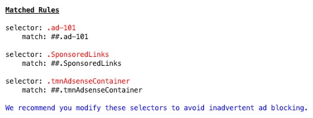

# [PostCSS Add Block Lint](https://github.com/dbtedman/postcss-add-block-lint)

[](https://www.npmjs.com/package/postcss-add-block-lint)
[](https://www.npmjs.com/package/postcss-add-block-lint)
[](https://www.npmjs.com/package/postcss-add-block-lint)
[](https://snyk.io/test/github/dbtedman/postcss-add-block-lint)
[](https://codeclimate.com/github/dbtedman/postcss-add-block-lint/maintainability)
[](https://codecov.io/gh/dbtedman/postcss-add-block-lint)
[](https://github.com/dbtedman/postcss-add-block-lint/actions?workflow=Test)

A [PostCSS](http://postcss.org) plugin that is used to lint css for existence of classes that might trigger add blockers.

-   [Where do I start?](#where-do-i-start)
-   [What options does it have?](#what-options-does-it-have)
-   [Want to lean more?](#want-to-lean-more)

## Where do I start?

> These instructions are only for this plugin. See the [PostCSS](http://postcss.org) website for framework information.

### Install

Using [Yarn](https://yarnpkg.com/en/package/postcss-add-block-lint)

```bash
yarn add postcss-add-block-lint --exact --dev
```

Using [NPM](https://www.npmjs.com/package/postcss-add-block-lint)

```bash
npm install postcss-add-block-lint --save-dev --save-exact
```

### Configure

Add to your [PostCSS](http://postcss.org) configuration.

```javascript
const Gulp = require("gulp");
const PostCSS = require("gulp-postcss");
const AddBlockLint = require("postcss-add-block-lint");

Gulp.task("css", () =>
    Gulp.src("./src/*.css").pipe(
        PostCSS([AddBlockLint({ easyList: `${__dirname}/data/easylist.txt` })])
    )
);
```

### Prepare

Ensure that ad blocking lists are downloaded to `./data` directory.

```bash
yarn prepare
```

### Review

When matches are found, they will be outputted to the console.



## What options does it have?

### Minimal

The minimal required configuration is the prefix selector, as shown in the above example.

```javascript
AddBlockLint({ easyList: `${__dirname}/data/easylist.txt` });
```

## Want to lean more?

-   See our [Contributing Guide](CONTRIBUTING.md) for details on how this repository is developed.
-   See our [Changelog](CHANGELOG.md) for details on which features, improvements, and bug fixes have been implemented
-   See our [License](LICENSE.md) for details on how you can use the code in this repository.
-   See our [Security Guide](SECURITY.md) for details on how security is considered.
